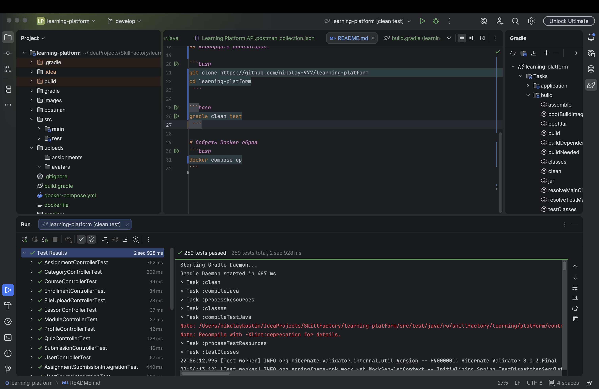

## Описание проекта:

Learning platform

## Технологии:

- Java 17+
- SpringBoot
- PostgreSql
- Lombok
- Gradle

## Требования:

1. Java 17+
2. Gradle
3. Docker

## Клонируйте репозиторий:

```bash
git clone https://github.com/nikolay-977/learning-platform
cd learning-platform
 ```

## Запустите тесты:

```bash
gradle clean test
 ```

## Результат прогона тестов:



## Разверните приложение в докере
```bash
docker compose up
```

## Postman колекции:
- [Learning Platform API.postman_collection.json](postman/Learning%20Platform%20API.postman_collection.json)
- [Learning Platform Full Environment.postman_environment.json](postman/Learning%20Platform%20Full%20Environment.postman_environment.json)

## Эндпоинты

### 1. ** Здоровье системы**
- `GET /actuator/health` - Проверка состояния API
- `POST /actuator/caches` - Очистка кэша приложения

### 2. ** Управление пользователями**
#### Создание пользователей
- `POST /api/v1/users` - Создание нового пользователя (Учитель/Студент/Админ)

#### Получение пользователей
- `GET /api/v1/users` - Все пользователи
- `GET /api/v1/users/{id}` - Пользователь по ID
- `GET /api/v1/users/{id}/detail` - Детальная информация о пользователе
- `GET /api/v1/users/role/{role}` - Пользователи по роли
- `GET /api/v1/users/search?keyword={}` - Поиск пользователей

#### Обновление пользователей
- `PUT /api/v1/users/{id}` - Обновление данных пользователя
- `PUT /api/v1/users/{id}/role/{role}` - Изменение роли пользователя
- `PUT /api/v1/users/{id}/deactivate` - Деактивация пользователя

#### Удаление
- `DELETE /api/v1/users/{id}` - Удаление пользователя

### 3. ** Категории курсов**
#### Создание категорий
- `POST /api/v1/categories` - Создание новой категории

#### Получение категорий
- `GET /api/v1/categories` - Все категории
- `GET /api/v1/categories/{id}` - Категория по ID
- `GET /api/v1/categories/{id}/detail` - Детальная информация о категории
- `GET /api/v1/categories/search?keyword={}` - Поиск категорий

#### Обновление и удаление
- `PUT /api/v1/categories/{id}` - Обновление категории
- `DELETE /api/v1/categories/{id}` - Удаление категории

### 4. ** Управление курсами**
#### Создание курсов
- `POST /api/v1/courses` - Создание нового курса

#### Получение курсов
- `GET /api/v1/courses` - Все курсы
- `GET /api/v1/courses/{id}` - Курс по ID
- `GET /api/v1/courses/{id}/detail` - Детальная информация о курсе
- `GET /api/v1/courses/category/{id}` - Курсы по категории
- `GET /api/v1/courses/search?keyword={}` - Поиск курсов
- `GET /api/v1/courses/{id}/students/count` - Количество студентов на курсе

#### Обновление
- `PUT /api/v1/courses/{id}` - Обновление курса

### 5. ** Записи на курсы (Enrollments)**
#### Запись на курсы
- `POST /api/v1/enrollments` - Запись студента на курс

#### Получение записей
- `GET /api/v1/enrollments/student/{id}` - Записи студента
- `GET /api/v1/enrollments/course/{id}` - Записи на курс
- `GET /api/v1/enrollments/student/{sid}/course/{cid}` - Статус записи

#### Управление статусом
- `PUT /api/v1/enrollments/{id}/status/{status}` - Изменение статуса записи
- `PUT /api/v1/enrollments/{id}/complete` - Завершение курса
- `DELETE /api/v1/enrollments/{id}` - Отмена записи

### 6. ** Модули курсов**
#### Создание модулей
- `POST /api/v1/modules` - Создание модуля

#### Получение модулей
- `GET /api/v1/modules/{id}` - Модуль по ID
- `GET /api/v1/modules/course/{id}` - Модули курса
- `GET /api/v1/modules/{id}/detail` - Детальная информация о модуле

#### Управление модулями
- `PUT /api/v1/modules/{id}` - Обновление модуля
- `PUT /api/v1/modules/{id}/reorder/{position}` - Изменение порядка модулей

### 7. ** Уроки модулей**
#### Создание уроков
- `POST /api/v1/lessons` - Создание урока

#### Получение уроков
- `GET /api/v1/lessons/{id}` - Урок по ID
- `GET /api/v1/lessons/{id}/detail` - Детальная информация об уроке
- `GET /api/v1/lessons/module/{id}` - Уроки модуля

#### Обновление
- `PUT /api/v1/lessons/{id}` - Обновление урока

### 8. ** Задания (Assignments)**
#### Создание заданий
- `POST /api/v1/assignments` - Создание задания

#### Получение заданий
- `GET /api/v1/assignments/{id}` - Задание по ID
- `GET /api/v1/assignments/{id}/detail` - Детальная информация о задании
- `GET /api/v1/assignments/lesson/{id}` - Задания урока
- `GET /api/v1/assignments/due-soon` - Задания с близким сроком сдачи

#### Обновление
- `PUT /api/v1/assignments/{id}` - Обновление задания

### 9. ** Сдача заданий (Submissions)**
#### Сдача работ
- `POST /api/v1/submissions/student/{id}` - Сдача задания

#### Получение работ
- `GET /api/v1/submissions/{id}` - Работа по ID
- `GET /api/v1/submissions/student/{id}` - Работы студента
- `GET /api/v1/submissions/assignment/{id}` - Работы по заданию
- `GET /api/v1/submissions/ungraded` - Непроверенные работы
- `GET /api/v1/submissions/student/{sid}/assignment/{aid}` - Работа студента по заданию

#### Оценка работ
- `PUT /api/v1/submissions/{id}/grade?score={}&feedback={}` - Оценка работы

### 10. ** Тесты (Quizzes)**
#### Создание тестов
- `POST /api/v1/quizzes` - Создание теста

#### Прохождение тестов
- `GET /api/v1/quizzes/{id}` - Тест по ID
- `GET /api/v1/quizzes/{id}/detail` - Детальная информация о тесте
- `POST /api/v1/quizzes/student/{id}/take` - Прохождение теста
- `GET /api/v1/quizzes/results/student/{id}` - Результаты тестов студента
- `POST /api/v1/quizzes/{id}/calculate-score` - Расчет оценки теста

### 11. ** Профили пользователей**
#### Управление профилями
- `POST /api/v1/profiles` - Создание профиля
- `GET /api/v1/profiles/user/{id}` - Профиль пользователя
- `PUT /api/v1/profiles/user/{id}` - Обновление профиля

### 12. ** Загрузка файлов**
#### Загрузка файлов
- `POST /api/v1/files/upload/avatar` - Загрузка аватара (multipart/form-data)
